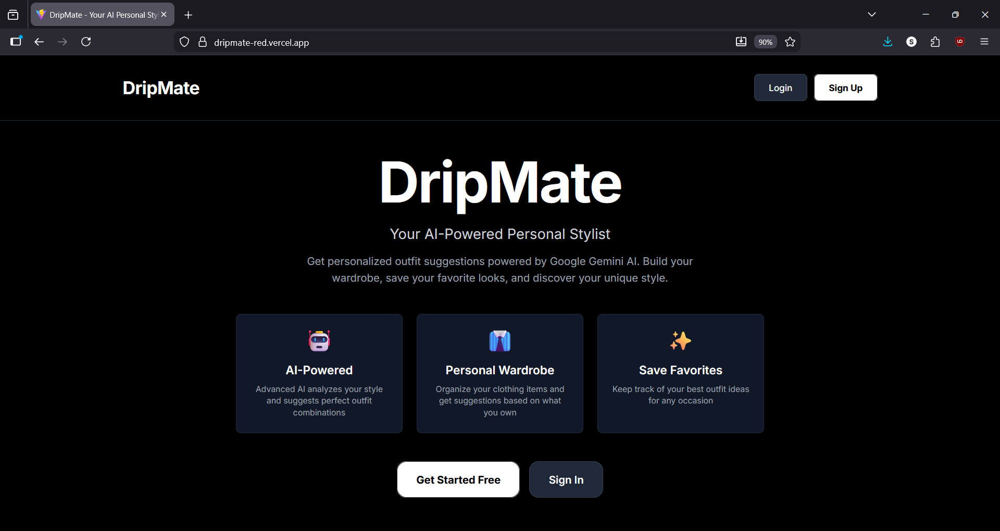
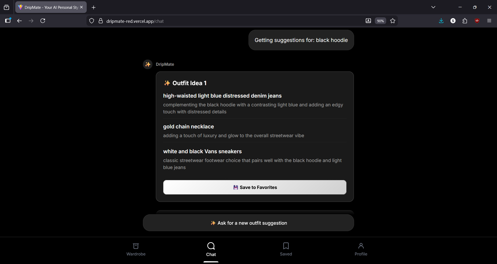
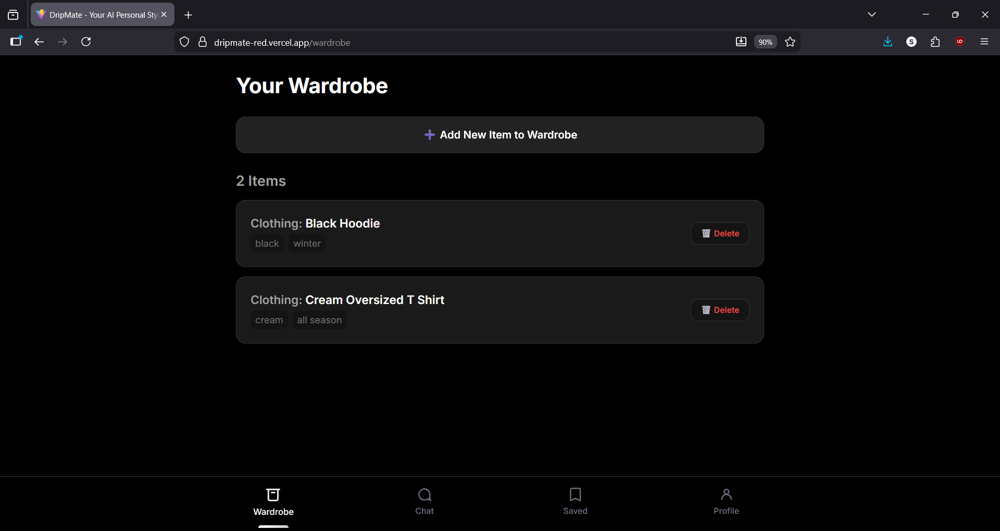
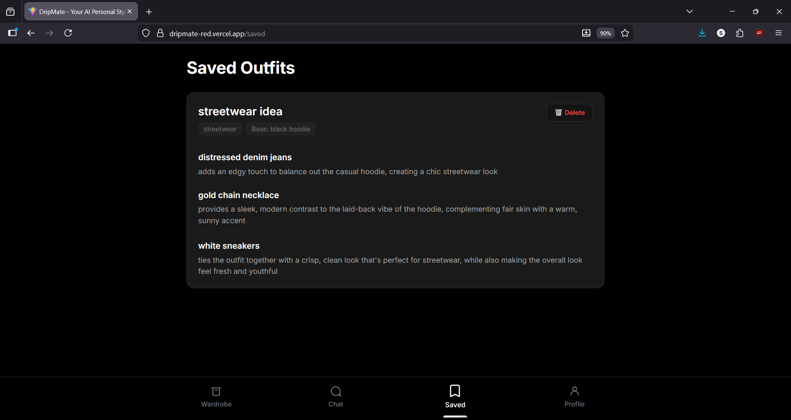

# 👔 DripMate

> **Your AI-Powered Personal Stylist**

DripMate is a full-stack web application that solves the everyday problem of choosing what to wear. It functions as an AI-powered personal stylist, providing complete, personalized outfit recommendations based on your actual wardrobe.

Try the working model here: [Live link](https://dripmate-red.vercel.app/)

## ✨ Features

### 🤖 AI-Powered Outfit Generation
- Get personalized outfit suggestions powered by Google's Gemini AI
- Receive styling advice tailored to occasions, weather, and your personal vibe
- Chat-based interface for natural conversation with your AI stylist

### 👕 Virtual Wardrobe Management
- Build and manage your digital wardrobe
- Add clothing items with detailed descriptions
- Upload images of your clothes for AI-powered analysis
- All outfit suggestions use only items from YOUR wardrobe

### 💬 Interactive Chat Experience
- Natural language conversation with your AI fashion assistant
- Context-aware responses based on your wardrobe
- Real-time outfit generation

### ❤️ Favorite Outfits
- Save your favorite outfit combinations
- Quick access to outfits that work for you
- Build a collection of go-to looks

### 🔐 User Authentication
- Secure user accounts with JWT authentication
- Personal wardrobe data protection
- Profile management

### 📱 Mobile-First Design
- Responsive, app-like interface
- Optimized for mobile devices
- Clean, modern UI with Tailwind CSS

## 📸 Screenshots

### Home Page


### Chat Interface


### Outfit Suggestions


### Wardrobe Management


### Saved Favorites


### Profile Page


## 🛠️ Technology Stack

### Backend
- **Framework**: FastAPI 0.115+
- **Database**: SQLAlchemy with SQLite
- **AI Integration**: Google Gemini AI, Groq API
- **Authentication**: JWT with python-jose
- **Image Processing**: Pillow
- **Password Hashing**: bcrypt

### Frontend
- **Framework**: React 19
- **Build Tool**: Vite 7
- **Styling**: Tailwind CSS 3.4
- **Routing**: React Router 6
- **HTTP Client**: Axios 1.12

## 🚀 Getting Started

### Prerequisites
- Python 3.8+
- Node.js 16+
- npm or yarn

### Installation

1. **Clone the repository**
   ```bash
   git clone https://github.com/Zentise/DripMate.git
   cd DripMate
   ```

2. **Set up the backend**
   ```bash
   cd backend
   pip install -r requirements.txt
   ```

3. **Configure environment variables**
   
   Create a `.env` file in the backend directory:
   ```env
   # API Keys
   GEMINI_API_KEY=your_gemini_api_key_here
   GROQ_API_KEY=your_groq_api_key_here
   
   # JWT Secret
   SECRET_KEY=your_secret_key_here
   
   # CORS (optional)
   ALLOWED_ORIGINS=http://localhost:5173,http://localhost:5174
   ```

4. **Run the backend**
   ```bash
   cd backend
   uvicorn main:app --reload
   ```
   The API will be available at `http://localhost:8000`

5. **Set up the frontend**
   ```bash
   cd frontend
   npm install
   ```

6. **Run the frontend**
   ```bash
   npm run dev
   ```
   The app will be available at `http://localhost:5173`

## 📖 API Documentation

Once the backend is running, visit:
- **Swagger UI**: http://localhost:8000/docs
- **ReDoc**: http://localhost:8000/redoc

### Key Endpoints

#### Authentication
- `POST /signup` - Create a new user account
- `POST /login` - Login and receive JWT token
- `GET /users/me` - Get current user profile

#### Chat
- `POST /chat` - Get AI outfit suggestions

#### Wardrobe
- `POST /wardrobe/add` - Add clothing item to wardrobe
- `GET /wardrobe/all` - Get all wardrobe items
- `DELETE /wardrobe/{item_id}` - Remove clothing item

#### Vision
- `POST /outfit-from-image` - Analyze clothing image with AI

#### Favorites
- `POST /favorites/add` - Save a favorite outfit
- `GET /favorites/all` - Get all saved favorites
- `DELETE /favorites/{favorite_id}` - Remove a favorite

## 🎯 Usage

1. **Sign Up**: Create your account
2. **Build Your Wardrobe**: Add your clothing items with descriptions or upload images
3. **Chat with AI**: Ask for outfit suggestions for any occasion
4. **Get Personalized Recommendations**: Receive complete outfits using only items from your wardrobe
5. **Save Favorites**: Keep track of your favorite combinations

## 🏗️ Project Structure

```
DripMate/
├── backend/
│   ├── main.py              # FastAPI application
│   ├── auth.py              # Authentication logic
│   ├── db.py                # Database models
│   ├── schemas.py           # Pydantic schemas
│   ├── llm.py               # AI/LLM integration
│   ├── vision.py            # Image analysis
│   ├── config.py            # Configuration
│   └── requirements.txt     # Python dependencies
├── frontend/
│   ├── src/
│   │   ├── App.jsx          # Main application component
│   │   ├── api/             # API client
│   │   ├── components/      # React components
│   │   └── pages/           # Page components
│   ├── package.json         # Node dependencies
│   └── vite.config.js       # Vite configuration
└── notes/                   # Documentation
```

## 🔑 Environment Variables

### Backend (.env)
| Variable | Description | Required |
|----------|-------------|----------|
| `GEMINI_API_KEY` | Google Gemini API key | Yes |
| `GROQ_API_KEY` | Groq API key | Optional |
| `SECRET_KEY` | JWT secret key | Yes |
| `ALLOWED_ORIGINS` | CORS allowed origins | No |

## 🌟 Features in Detail

### Virtual Wardrobe
Unlike generic fashion apps, DripMate builds outfits using only items you actually own. Every piece of clothing you add to your wardrobe becomes part of the AI's knowledge base, ensuring practical and accessible recommendations.

### AI-Powered Styling
Powered by Google's Gemini AI, DripMate understands fashion trends, color theory, and style compatibility. It can suggest outfits for any occasion—from casual hangouts to formal events.

### Image Recognition
Upload photos of your clothes, and the AI automatically extracts details like color, style, and type, making it effortless to build your digital wardrobe.

## 🚧 Development Stages

### ✅ Stage I: Text-Based MVP (Complete)
- Basic chat interface
- AI outfit generation from text descriptions
- Proof of concept

### ✅ Stage II: Wardrobe Integration (Complete)
- Database implementation
- Wardrobe management system
- Wardrobe-aware AI suggestions
- Full UI redesign

### 🔄 Stage III: Enhanced Image System (In Progress)
- Advanced computer vision integration
- Automatic clothing item extraction from images
- Improved image analysis accuracy

## 📝 License

This project is licensed under the MIT License - see the [LICENSE](LICENSE) file for details.

## 👨‍💻 Author

**[Shrijith S Menon](https://github.com/shrijithSM)**

## 📧 Contact

For questions or support, please open an issue on GitHub.

---

Made with ❤️ by [Shrijith S Menon](https://www.shrijithsm.tech)
